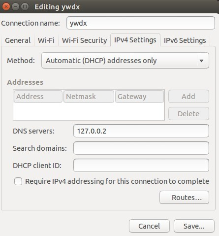

Since shnatsel's ppa doesn't have dnscrypt-proxy for ubuntu(14.10, 14.04 and 12.04), I've found a new ppa that we can install and update dnscrypt.

```
sudo add-apt-repository ppa:anton+/dnscrypt
```

```
sudo apt-get update
```

```
sudo apt-get install dnscrypt-proxy
```

Then configure network settings and set dns to 127.0.0.2



start the deamon

```
sudo service dnscrypt-proxy start
```

the daemon will listen on port 53 of address 127.0.0.2, check if dnscrypt is working by using:

```
sudo tcpdump -i wlan0 dst host 176.56.237.171
```

note that the interface above should be changed to the one actually in using

it's output should look like:

```
13:55:38.033800 IP 192.168.108.16.34863 > resolver1.dnscrypt.eu.https: UDP, length 512
```

Dnscrpyt can be used directly as your local resolver or as a DNS forwarder. It can prevent us from DNS cache poisoning and DNS spoofing effectively.
